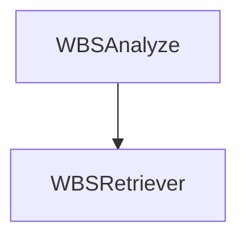
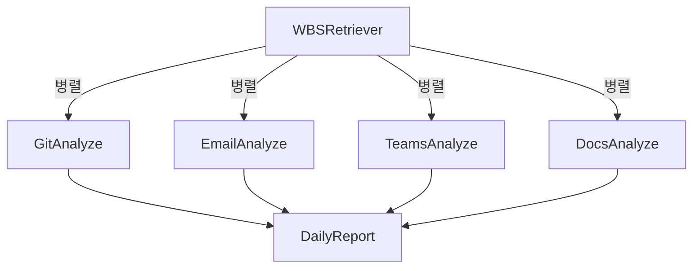
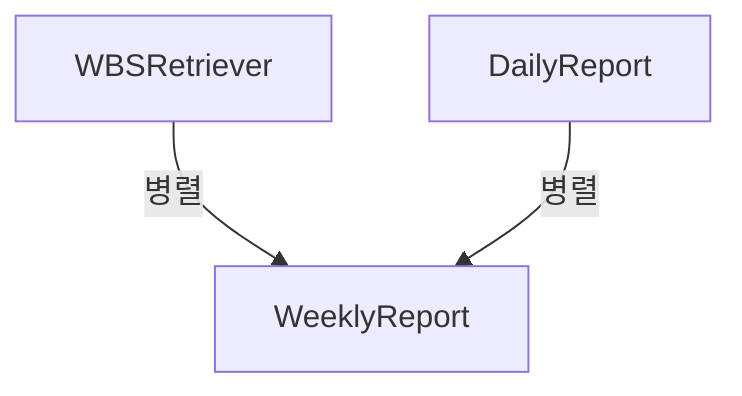

# 개인 업무 관리 AI 서비스 - 보고서 생성 시스템

VectorDB에 저장된 업무 데이터를 기반으로 AI 에이전트가 자동으로 일간/주간 보고서를 생성하는 지능형 보고서 생성 시스템입니다. 

수집된 업무 데이터를 분석하여 개인 생산성 리포트, 팀 활동 요약, 프로젝트 진행 상황 등을 자동으로 생성합니다.

---

## 📁 프로젝트 구조 
```bash
AI-end/
├── agents/                    # AI 에이전트 모듈
│   ├── daily_report_agent.py
│   ├── weekly_report_agent.py
│   ├── team_analyzer_agent.py
│   └── wbs_analysis_agent.py
├── graphs/                    # 에이전트 워크플로우 그래프
│   ├── daily_graph.py
│   ├── weekly_graph.py
│   └── team_weekly_graph.py
├── prompts/                   # AI 프롬프트 템플릿
│   ├── daily_report_prompt.md
│   ├── weekly_report_prompt.md
│   ├── team_weekly_report_prompt.md
│   └── wbs_analysis_prompt.md
├── teams_analyzer/            # 팀 분석 전용 모듈
│   └── teams_analyzer.py
├── tools/                     # 유틸리티 도구
│   ├── vector_db_retriever.py
│   ├── wbs_data_retriever.py
│   └── wbs_retriever_tool.py
├── utils/                     # 공통 유틸리티
│   ├── embed_query.py
│   ├── file_processor.py
│   └── llm_interface.py
├── api/                       # REST API 엔드포인트
│   ├── dto/                   # 데이터 전송 객체
│   ├── core/                  # 핵심 API 로직
│   └── endpoints.py
├── schemas/                   # 데이터 스키마
│   ├── project_info.py
│   ├── team_info.py
│   └── user_info.py
├── service/                   # 비즈니스 로직 서비스
│   ├── daily_report_service.py
│   ├── weekly_report_service.py
│   ├── team_weekly_service.py
│   └── run_wbs_analyzer.py
└── main.py                   # 메인 실행 파일

k8s/                          # Kubernetes 배포 설정
├── deploy.yaml
├── service.yaml
└── ingress.yaml

batch_main.py                 # 배치 실행 스크립트
daily_main.py                 # 일간 보고서 생성기
team_weekly_main.py           # 팀 주간 보고서 생성기
wbs_main.py                   # WBS 분석 실행기
weekly_main.py                # 주간 보고서 생성기
```

---

## 🚀 설치 및 실행

### 사전 요구사항
- Python 3.8+
- Docker
- VectorDB (Qdrant)
- OpenAI API 키 또는 로컬 LLM

### 로컬 설치
```sh
# 저장소 클론
git clone [repository-url]
cd AI-end

# 가상환경 생성 및 활성화
python -m venv venv
source venv/bin/activate  # Linux/Mac
venv\Scripts\activate   # Windows

# 의존성 설치
pip install -r requirements.txt

# 환경변수 설정
cp .env.example .env
# .env 파일에 필요한 AI 모델 및 DB 설정값 입력
```

## 🔧 사용법
### 로컬 실행
```sh
python -m uvicorn main:app --host 0.0.0.0 --port 8001
```

### 도커 이미지 빌드 및 k8s 배포
```sh
./base-build.sh # 도커 이미지 빌드 및 배포

cd k8s/
kubectl -f apply deploy.yaml ingress.yaml service.yaml
```

## 🏗️ 프로젝트 아키텍처 (System Architecture)

### 개인 Daily 보고서 Agent 흐름 


### 개인 Weekly 보고서 Agent 흐름


### 팀 Weekly 보고서 Agent 흐름


### WBS 분석 Architecture 


### 개인 Daily 보고서 Architecture 


### 개인 Weekly 보고서 Architecture


### 팀 Weekly 보고서 Architecture
 ```mermaid
graph TD;
    WBSRetriever -->|병렬| TeamWeeklyReport
    WeeklyReport -->|병렬| TeamWeeklyReport
```

흐름 요약:
WBS 분석 → 캐싱

병렬 데이터 분석 (Git, Email, Teams, Docs)

분석 결과 → 종합 보고서 생성
